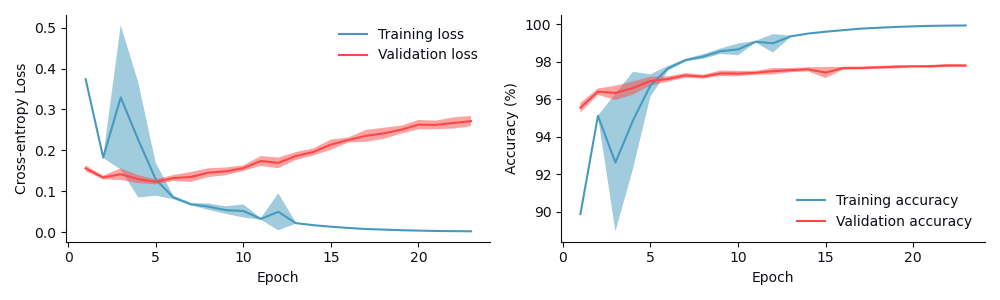

<div align="center">
<picture>
    <source media="(prefers-color-scheme: dark)" srcset="./data/resources/descraibe-it-header-dark.png">
    
</picture>

---

Inspired by [Quick, Draw!](https://quickdraw.withgoogle.com/), *DescrAIbe It* is a text-based alternative where players must describe words for a trained NLP model to guess.
This is done by collecting a dataset of over 180,000 descriptions spread over 25 words.

</div>


## Installation

Create a conda environment with a name of your choice with Python version 3.10:


```python
conda create -n <env_name> python=3.10
```

Activate it and install all necessary libraries:

```python
pip install -r requirements.txt
```


### Reproducing the Results

Run the following commands to run a specified model on the data (for the setup used here, see ...).

```python
python main.py --model [model] [verbosity]
```

The model arguments are: `knn`, `xgboost`, `svm` or `lstm`. To turn on the verbosity, add `--verbose` to the end of the command.

In order to run the LSTM model, you need to download the [pretrained GloVe word embeddings](https://nlp.stanford.edu/projects/glove/) (840B tokens + 300d vectors) and add them to the folder `data/embeddings`.


## Methodology

### Data Overview
The dataset is created through three key phases: selection, collection, and preparation. Each phase is detailed below 
to provide a clear understanding of the data pipeline.

#### Data Selection
The first step towards collecting the dataset consists of selecting which words will 
need to be described by the player. We take inspiration from the game [Quick, Draw!](https://quickdraw.withgoogle.com/), 
a computer vision alternative which uses doodles instead of text descriptions. 
First, we select the [words](https://github.com/googlecreativelab/quickdraw-dataset/blob/master/categories.txt) used in that game.
As our approach to word selection is based on word embeddings, we remove all [entries](./data/saved/categories_289.txt) consisting of more than one word to ensure we can compare
the embeddings with each other.

From these remaining words, we further narrow them down to a subset of 25. This is done in the interest of 
the time and resource costs incurred by using OpenAI's API for large scale purposes, as many descriptions per word will be 
needed to accurately and fairly evaluate the validity of the more data hungry neural models. 

To select a suitable set of 25 words, we aim to create as semantically a diverse subset as possible.
This can be achieved by maximizing the minimum distance between the embeddings associated with each of the selected words.
More formally, for a set of words $W$, we want to find the subset of words $W' \subset W$ using the Euclidean
distance function $d(e(w_i), e(w_j))$, where $e(w)$ returns the embedding associated with word $w \in W$.
The subset $W'$ should satisfy the following:

$$
\mathop{\max} \left( \mathop{\min}\limits_{w_i, w_j \in W' \atop i \neq j} d \left( e(w_i), e(w_j) \right) \right)
$$

This is known as the [<em>max-min diversity problem</em>](https://citeseerx.ist.psu.edu/document?repid=rep1&type=pdf&doi=51f97d822ec695f5700ac353bfff285bd44ef0e7) and is considered NP-hard. 
As such, we use a greedy algorithm that approximates the optimal subset. The embeddings we use are [pretrained GloVe word embeddings](https://nlp.stanford.edu/projects/glove/) (840B tokens + 300d vectors).

The [final set of selected words](./data/saved/categories_25.txt) are visualized below using t-SNE (2 components, perplexity is 24). 


#### Data Collection
For each of the selected 25 words, we [prompt ChatGPT](./data/PromptManager.py) for a textual description of the given word. The prompt template used for ChatGPT is parameterized across six aspects. The template is as follows:

```diff
Give me [length] [detail] unique descriptions of [word]. Do not include the word [word] or any of its variations in your response. Use [complexity] language in your response. Start all your responses with [prefix].
```

The six parameters included in the template:
- Word: the given word that needs to be described by ChatGPT.
- Length: number of descriptions to generate per prompt for a given word. It will always generate 20 descriptions.
- Level of detail: length of each description for a given word. The possible values are: <em>very simple</em>, <em>simple</em>, <em>long</em>, <em>very long</em>, or blank (i.e., not specified).
- Complexity: type of diction used in each description for a given word (e.g., sophisticated vs. simple). The possible values are: <em>very simple</em>, <em>simple</em>, <em>complex</em>, <em>very complex</em>, or blank (i.e., not specified).
- Prefix: the first word that needs to be used in the description (designed to encourage difference sentence structures). The possible values are: <em>it</em>, <em>this</em>, <em>a</em>, <em>the</em>, <em>with</em>, or blank (i.e., not specified). If the prefix is blank, then the last sentence in the prompt template is also removed.
- Temperature: value of the temperature variable used in call to ChatGPT's API. The possible values are: 0.2, 0.6, or 1.

We compute all possible combinations of these parameters for each word to generate [7200 descriptions per word](./data/saved/raw_descriptions.csv) (180,000 in total). 
The chosen sample size per word is based on MNIST (7000 images per digit).


#### Data Preparation
The [preprocessing pipeline](./data/PreprocessingPipeline.py) we use consists of the following sequence of steps:
1. Making all text lowercase.
2. Expanding all contractions (e.g., can't &rarr; can not).
3. Removing all stopwords (e.g., a, the, it, etc.).
4. Cleaning all text (e.g., punctuation, hyperlinks, etc.).

We also remove all duplicates and use label encoding. Lemmatization was initially explored as a method for text standardization, but it 
was ultimately discarded after experiments showed it reduced performance.

The [train-test-validation](./data/splits) split is 55%-30%-15%. It is a random split since there is a class balance, as shown below:

<p align="center">
  
</p>


### Model Development
We experiment with three different models: a [kNN](./models/kNN.py), [SVM](./models/SVM.py) and [LSTM](./models/LSTM.py).

#### Hyperparameter Tuning

Due to the size of the hyperparameter space of the LSTM and to enable fair comparison between models, 
we restrict the tuning process to a single train-validation split (as defined [here](#data-preparation)). 
We use Grid Search (kNN, SVM) and Bayesian Optimization (LSTM).
The method used is determined by the number of hyperparameters, where Grid Search
is used for smaller search spaces and Bayesian Optimization is used for larger ones.


<table>
    <thead>
        <tr>
            <th>Model</th>
            <th>Type</th>
            <th>Hyperparameter</th>
            <th><span>Tuning</span>
method<span></span></th>
            <th>Range</th>
            <th>Auto-selected value</th>
            <th>Final value</th>
        </tr>
    </thead>
    <tbody>
        <tr>
            <td rowspan=2><a href="./results/knn/knn_results.json">kNN</a></td>
            <td colspan="2"># neighbours</td>
            <td rowspan="2">Grid Search</td>
            <td>{1, 2, ..., 50}</td>
            <td colspan="2">35</td>
        </tr>
        <tr>
            <td colspan="2">Weight type</td>
            <td>{distance, uniform}</td>
            <td colspan="2">distance</td>
        </tr>
        <tr>
            <td rowspan=2><a href="./results/svm/svm_results.json">SVM</a></td>
            <td colspan="2">$C$</td>
            <td rowspan="2">Grid Search</td>
            <td>{10<sup>-1</sup>, 1, ..., 10<sup>3</sup>}</td>
            <td colspan="2">10</td>
        </tr>
        <tr>
            <td colspan="2">$\gamma$</td>
            <td>{10<sup>-4</sup>, 10<sup>-3</sup>, ..., 10<sup>1</sup>}</td>
            <td colspan="2">1</td>
        </tr>
        <tr>
            <td rowspan=10><a href="./results/lstm">LSTM</a><sup>1</sup></td>
            <td rowspan=4><a href="./results/lstm/lstm_results_arch_1.json">Architecture</a></td>
            <td># LSTM units</td>
            <td rowspan="10">Bayesian Optimization</td>
            <td>{64, 128, ..., 512}</td>
            <td colspan="2">448</td>
        </tr>
        <tr>
            <td># FC layers</td>
            <td>{1, 2}</td>
            <td colspan="2">1</td>
        </tr>
        <tr>
            <td># units per FC layer</td>
            <td>{128, 256, ..., 1024}</td>
            <td colspan="2">384</td>
        </tr>
        <tr>
            <td>Dropout per FC layer</td>
            <td>{0.1, 0.3, ..., 0.7}</td>
            <td>0.3</td>
            <td>0.7</td>
        </tr>
        <tr>
            <td rowspan=3><a href="./results/lstm/lstm_results_adam_1.json">LR Schedule</a></td>
            <td>Scheduler</td>
            <td colspan="3">Cosine Decay</td>
        </tr>
        <tr>
            <td>Initial LR</td>
            <td>[10<sup>-4</sup>, 10<sup>-3</sup>]</td>
            <td>9.99 $\times$ 10<sup>-4</sup></td>
            <td>10<sup>-3</sup></td>
        </tr>
        <tr>
            <td># decay steps</td>
            <td>{25, 50, ..., 250}</td>
            <td>250</td>
            <td>25</td>
        </tr>
        <tr>
            <td rowspan=3><a href="./results/lstm/lstm_results_adam_1.json">Optimizer</a></td>
            <td>Optimizer</td>
            <td>{Adam, SGD}</td>
            <td colspan="2">Adam</td>
        </tr>
        <tr>
            <td>$\beta_1$</td>
            <td>[0, 0.9999]</td>
            <td colspan="2">0.906</td>
        </tr>
        <tr>
            <td>$\beta_2$</td>
            <td>[0.9, 0.9999]</td>
            <td colspan="2">0.955</td>
        </tr>
    </tbody>
</table>

<sup>1</sup> The loss function used for all LSTM experiments is sparse cross-entropy as the labels are not one-hot encoded.

### Results

<div align="center">
    <table>
        <thead>
            <th>Model</th>
            <th>Accuracy</th>
            <th>Precision</th>
            <th>Recall</th>
            <th>F1-score</th>
        </thead>
        <tbody>
            <tr>
                <td>kNN</td>
                <td>94.37</td>
                <td>94.42</td>
                <td>94.38</td>
                <td>94.38</td>
            </tr>
            <tr>
                <td>XGBoost</td>
                <td>95.84</td>
                <td>95.86</td>
                <td>95.85</td>
                <td>95.85</td>
            </tr>
            <tr>
                <td>SVM</td>
                <td>97.51</td>
                <td>97.53</td>
                <td>97.51</td>
                <td>97.52</td>
            </tr>
            <tr>
                <td>LSTM</td>
                <td><b>97.75</b></td>
                <td><b>97.75</b></td>
                <td><b>97.75</b></td>
                <td><b>97.75</b></td>
            </tr>
        </tbody>
    </table>
</div>

<picture>
    <source media="(prefers-color-scheme: dark)" srcset="./results/lstm/lstm_loss_acc_plot_dark.png">
    
</picture>