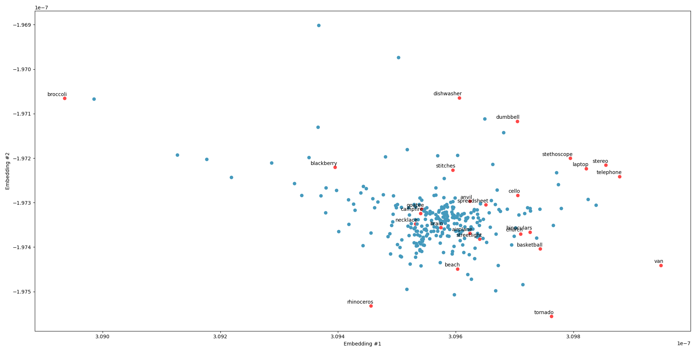

<div align="center">
<picture>
    <source media="(prefers-color-scheme: dark)" srcset="./data/resources/descraibe-it-header-dark.png">
    
</picture>
</div>

## Installation

### Reproducing the Results


## Methodology

### Data Overview
The dataset is created through three key phases: selection, collection, and preparation. Each phase is detailed below 
to provide a clear understanding of the data pipeline.

#### Data Selection
The first step towards collecting the dataset consists of selecting which words will 
need to be described by the player. We take inspiration from the game [Quick, Draw!](https://quickdraw.withgoogle.com/), 
a computer vision alternative which uses doodles instead of text descriptions. 
First, we select the [words](https://github.com/googlecreativelab/quickdraw-dataset/blob/master/categories.txt) used in that game.
As our approach to word selection is based on word embeddings, we remove all [entries](./data/saved/categories_289.txt) consisting of more than one word to ensure we can compare
the embeddings with each other.

From these remaining words, we aim to find the subset of words that maximizes the 
semantic differences between them. This is performed by finding the subset of words that
maximizes the minimum distance of the embeddings associated with each word. More formally, for a set of words $W$, we want to find the subset of words $W' \subset W$ using the Euclidean
distance function $d(e(w_i), e(w_j))$, where $e(w)$ returns the embedding associated with word $w \in W$.
The subset $W'$ should satisfy the following equation:

$$
\mathop{\max} \mathop{\min}\limits_{w_i, w_j \in W, i \neq j} d(e(w_i), e(w_j))
$$

This problem is known as the [<em>max-min diversity problem</em>](https://citeseerx.ist.psu.edu/document?repid=rep1&type=pdf&doi=51f97d822ec695f5700ac353bfff285bd44ef0e7) and is considered NP-hard. 
As such, we use a greedy algorithm that approximates the optimal subset. The size of this subset is 25 words (see below for explanation) and the embeddings we use are [pretrained GloVe word embeddings](https://nlp.stanford.edu/projects/glove/) (840B tokens + 300d vectors).

The [final set of selected words](./data/saved/categories_25.txt) are visualized below using t-SNE (2 components, perplexity is 24). 




#### Data Collection
For each of the selected 25 words, we prompt ChatGPT for a textual description of the given word. The prompt template used for ChatGPT is parameterized across five aspects. The template is the following:

```diff
Give me [length] [detail] unique descriptions of [word]. Do not include the word [word] or any of its variations in your response. Use [complexity] language in your response. Start all your responses with [prefix].
```

The prompt used for ChatGPT is parameterized across five aspects:
- Word: the given word that needs to be described by ChatGPT.
- Length: number of descriptions to generate per prompt for a given word. It will always generate 20 descriptions.
- Level of detail: length of each description for a given word. The possible values are: <em>very simple</em>, <em>simple</em>, <em>long</em>, <em>very long</em>, or blank (i.e., not specified).
- Complexity: type of diction used in each description for a given word (e.g., sophisticated vs. simple). The possible values are: <em>very simple</em>, <em>simple</em>, <em>complex</em>, <em>very complex</em>, or blank (i.e., not specified).
- Prefix: the first word that needs to be used in the description (designed to encourage difference sentence structures). The possible values are: <em>it</em>, <em>this</em>, <em>a</em>, <em>the</em>, <em>with</em>, or blank (i.e., not specified). If the prefix is blank, then the last sentence in the prompt template is also removed.
- Temperature: value of the temperature variable used in call to ChatGPT's API. The possible values are: 0.2, 0.6, or 1.

We compute all possible combinations of these parameters for each word to generate [7200 descriptions per word](./data/saved/raw_descriptions.csv) (180,000 in total). 
The chosen sample size per word is based on MNIST (7000 images per digit) and is intended to enable to validity of the 
more data hungry neural models. The reason why only 25 words are chosen is due to prohibitively high time and resource
costs incurred by accessing the OpenAI API for large scale purposes.


#### Data Preparation

### Model Development

### Results